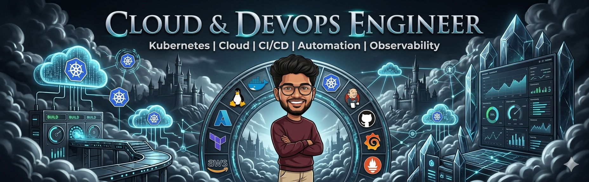

  

  

---

## About

With a background in backend development, I focus on building and managing scalable cloud infrastructure, automating CI/CD pipelines, and improving application reliability. I work extensively with Kubernetes, Docker, Azure, AWS, Jenkins, Terraform, and modern observability tooling. My goal is to bridge development and operations through automation, security, and continuous improvement — open-source first, managed where it makes sense.

---

  

---

## What I Do

- I provision and manage scalable cloud infrastructure across Azure, AWS, and GCP — so your systems stay available, your team stays unblocked, and deployments never become emergencies.
- I build CI/CD pipelines with security baked in at every stage — automated scanning with Hadolint, Trivy, and OWASP means vulnerabilities are caught at build time, not after an incident.
- I run Kubernetes clusters in production — with Jenkins-driven deployments as the primary delivery mechanism and Argo CD for GitOps workflows where it fits, backed by autoscaling and cost intelligence so the cloud bill never surprises anyone.
- I wire up full-stack observability from day one — metrics, logs, and distributed traces unified in Grafana so your team sees problems before users do and fixes them with evidence, not guesswork.
- I turn infrastructure into repeatable, auditable code using Terraform and Ansible — eliminating environment drift, reducing manual handoffs, and making every environment from dev to production genuinely identical.

 

---

## Technology Stack

 

<table width="100%" cellspacing="0" cellpadding="16">

<tr>
<!-- ── CLOUDS ── -->
<td align="center" valign="top" width="50%">

  

</td>

<!-- ── IaC & AUTOMATION ── -->
<td align="center" valign="top" width="50%">

  

</td>
</tr>

<tr>
<!-- ── CI/CD ── -->
<td align="center" valign="top">

  

  

</td>

<!-- ── CONTAINER ORCHESTRATION ── -->
<td align="center" valign="top">

  

  

&nbsp;

</td>
</tr>

<tr>
<!-- ── REPOSITORY MANAGEMENT ── -->
<td align="center" valign="top">

  

  

</td>

<!-- ── OBSERVABILITY ── -->
<td align="center" valign="top">

  

  

&nbsp;

&nbsp;

&nbsp;

</td>
</tr>

<tr>
<!-- ── SECURITY & DEVSECOPS ── -->
<td align="center" valign="top">

  

&nbsp;

  

&nbsp;

</td>

<!-- ── COST MONITORING ── -->
<td align="center" valign="top">

  

  

</td>
</tr>

<tr>
<!-- ── OS ── -->
<td align="center" valign="top">

  

</td>

<!-- ── LANGUAGES & DATABASES ── -->
<td align="center" valign="top">

  

  

</td>
</tr>

</table>

 

---

---

## GitHub Stats

  

  

---

## Contribution Activity

  <picture>
    <source media="(prefers-color-scheme: dark)" srcset="https://raw.githubusercontent.com/Karthick944429/Karthick944429/output/pacman-contribution-graph-dark.svg">
    <source media="(prefers-color-scheme: light)" srcset="https://raw.githubusercontent.com/Karthick944429/Karthick944429/output/pacman-contribution-graph.svg">
    
  </picture>

---

## Contact

  
  &nbsp;&nbsp;&nbsp;&nbsp;&nbsp;&nbsp;
  
  &nbsp;&nbsp;&nbsp;&nbsp;&nbsp;&nbsp;
  

